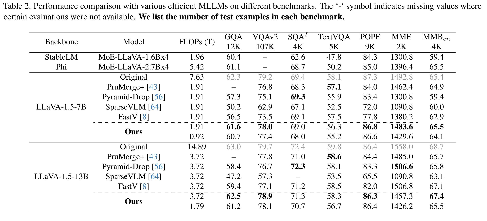
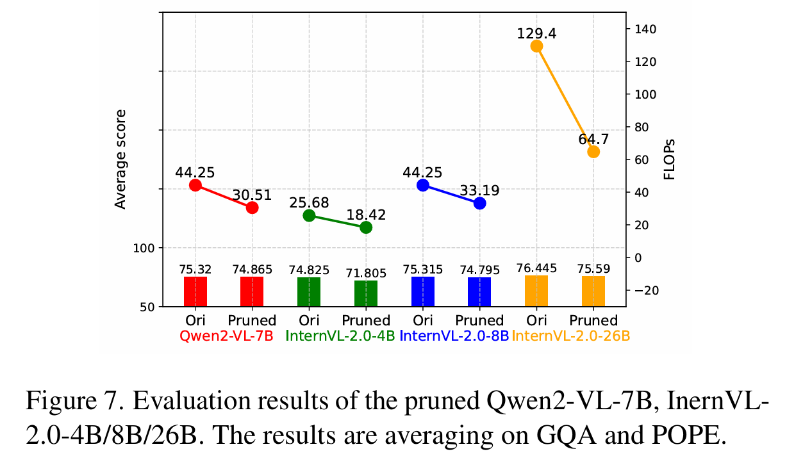

# :rocket: YOPO: You Only Prune Once for Your MLLMs


This repository contains the core code to implement the idea of  our paper:

[Treat Visual Tokens as Text? But Your MLLM Only Needs Fewer Efforts to See](https://arxiv.org/abs/2410.06169v2)


### :bangbang: While many studies focus on pruning visual tokens to reduce the computational overhead caused by visual redundancy, the process of identifying these tokens for each conversation is itself resource-intensive. Now the question comes, ###  

### **Can we prune our MLLM just once instead?**:interrobang: ###


## Installation
1. set up LLavA  
```Shell
cd LLaVA
conda create -n llava python=3.10 -y
conda activate llava
pip install --upgrade pip  
pip install -e .
pip install -e ".[train]"
pip install flash-attn --no-build-isolation
```

2. copy our updated `modeling_llama.py` to transformer library
```Shell
cp ../modeling_llama_prune.py {YOUR ENV PATH}/lib/python3.10/site-packages/transformers//models/llama/modeling_llama.py
# eg. cp ../modeling_llama_prune.py /opt/conda/envs/llava/lib/python3.10/site-packages/transformers//models/llama/modeling_llama.py

```

3. Download the checkpoints of pruned LLaVA

1. [LLaVA-1.5-7B (12% FLOPs)](https://huggingface.co/zwt123home123/llava-1.5-7b-prune-zp12)
2. [LLaVA-1.5-7B (25% FLOPs)](https://huggingface.co/zwt123home123/llava-1.5-13b-prune-zp25)
3. [LLaVA-1.5-13B (12% FLOPs)](https://huggingface.co/zwt123home123/llava-1.5-7b-prune-zp12)
4. [LLaVA-1.5-13B (25% FLOPs)](https://huggingface.co/zwt123home123/llava-1.5-13b-prune-zp25)

:warning: for sanity check, please refer to the [infer.sh](infer.sh).

:triangular_flag_on_post:  We will release the code for pruning the visual computation in Qwen, InternVL without the fine-tuning process very soon.  
:triangular_flag_on_post:  The code for training pruned LLava will also be released soon.  


## Main result




## Citation

If you find the idea or code useful for your research, please consider citing our [paper](https://arxiv.org/abs/2403.12777):

```
@article{zhang2024treat,
  title={Treat Visual Tokens as Text? But Your MLLM Only Needs Fewer Efforts to See},
  author={Zhang, Zeliang and Pham, Phu and Zhao, Wentian and Wan, Kun and Li, Yu-Jhe and Zhou, Jianing and Miranda, Daniel and Kale, Ajinkya and Xu, Chenliang},
  journal={arXiv preprint arXiv:2410.06169},
  year={2024}
}
```

## Contact
Questions and suggestions can be sent to hust0426@gmail.com and {wezhao, kuwan}@adobe.com.
